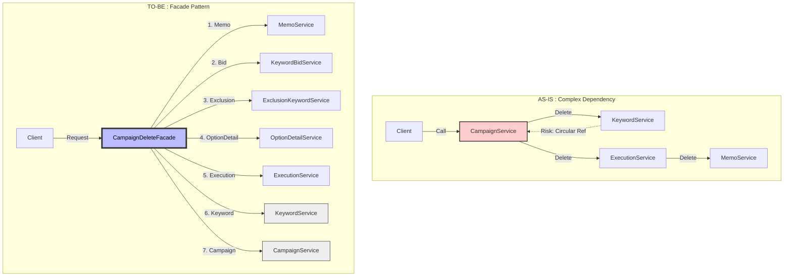

# 🚀 CascadeType.REMOVE 설정된 Entity 의 Delete API 부하테스트 및 리팩토링

CascadeType.Remove 를 통해 자식 - 부모 데이터를 일괄 삭제하는 것은 예상치 못한 자식의 삭제로 해당 자식을 외래키는 갖는(손자) 데이터에 대해 무결성 문제 및
복잡한 엔티티 관계가 설정되어 있는경우 예상치 못한 데이터가 삭제되는 것과 같이 다양한 문제를 일으킬 수 있다.
이번 리팩토링에서는 성능에 대해 집중하여 실제로 CascadeType.Remove가 어떤  성능적 이슈를 야기하는지 부하테스트를 통해 확인하고,
부하테스트 결과에 따른 적절한 해결방안을 통해 해당 문제를 해결하는 과정을 담고 있습니다.

---
## 📖 목차 (Table of Contents)

1.  [**문제 정의 (The Problem)**](#1-문제-정의-the-problem)
    * [CascadeType.REMOVE](#CascadeType.REMOVE)
    * [내 프로젝트에서 발견된 문제점](#내-프로젝트에서-발견된-문제점)
2.  [**성능 측정 (Before) - 리팩토링 전**](#2-성능-측정-before---리팩토링-전)
    * [부하 시나리오](#부하-시나리오)
    * [쿼리 로그 ](#쿼리-로그)
    * [k6 부하 테스트 결과 (Before)](#k6-부하-테스트-결과-before)
3.  [**해결 (Solution)**](#3-해결)
    * [Facade 패턴 적용](#Facade-패턴-적용)
    * [Bulk Delete 적용](#Bulk-Delete)
4.  [**검증 (After) - 리팩토링 후**](#4-검증---리팩토링-후)
    * [쿼리 로그 (최적화 확인)](#쿼리-로그-1)
    * [k6 부하 테스트 결과 (After)](#k6-테스트-결과-성능-개선)
5.  [**결론 (Conclusion)**](#5-결론)
    * [성능 개선 비교](#성능-개선-비교)
    * [배운 점](#배운-점)

---

## 1. 문제 정의

###  CascadeType.REMOVE

`CascadeType.REMOVE`는 부모 엔티티 삭제 시 연관된 자식 엔티티를 영속성 컨텍스트가 감지하여 삭제합니다. 
하지만 이 과정은 **(1) 자식 엔티티 조회(SELECT)** 후 **(2) 건별 삭제(DELETE)**로 이루어지기 때문에, 
자식 데이터가 많을수록 쿼리 수가 기하급수적으로 늘어나는 비효율이 발생합니다.

### 내 프로젝트에서 발견된 문제점

* api : Delete /api/campaign/deleteCampaign (요청한 캠패인들에 대한 모든 데이터 삭제)
* **증상:** 해당 API 호출 시 간헐적 타임아웃 발생. 옵저버빌리티 모니터링 결과 비정상적인 쿼리 수행 횟수 관측.

---

## 2. 성능 측정 (Before) - 리팩토링 전

### 부하 시나리오
* **목표:** DAU 500명 PCU 50명 기준, P95 응답시간 **1초 미만** 유지.
* **데이터 분포 (파레토 법칙 적용):**
    * Light User (80%): 데이터 100개 보유
    * Heavy User (15%): 데이터 2,000개 보유
    * Outlier (5%): 데이터 17,000개 보유
* **테스트 시나리오:**
    * **Background Traffic:** 평상시 트래픽 (단순 조회 API)
    * **Spike Traffic:** 피크 타임 동시 접속자의 10%가 동시에 **대량 삭제**를 요청하는 상황. 

<details>
<summary>👉 (Click) k6 스크립트 확인하기 </summary>

    ```javascript
    import http from 'k6/http';
    import { check, sleep } from 'k6';
    import exec from 'k6/execution';
    // -----------------------------------------------------------------------
    // 1. 🏗️ 유저 데이터 생성 (User Data Generation)
    //    - 전체 500명 (일반 400 + 헤비 75 + 아웃라이어 25)
    // -----------------------------------------------------------------------
    const TOTAL_USERS = 500;
    const RATIO = { light: 0.80, heavy: 0.15, outlier: 0.05 };
    function generateUsers() {
        const users = [];
        const lightCount = TOTAL_USERS * RATIO.light;     // 400명
        const heavyCount = TOTAL_USERS * RATIO.heavy;     // 75명
        const outlierCount = TOTAL_USERS * RATIO.outlier; // 25명
        const lightEnd = lightCount;                        // 1 ~ 400
        const heavyEnd = lightCount + heavyCount;           // 401 ~ 475
        const outlierEnd = TOTAL_USERS;                     // 476 ~ 500
        // 1. 일반 유저 (1 ~ 400)
        for (let i = 1; i <= lightEnd; i++) {
            const idStr = i.toString().padStart(2, '0');
            users.push({ id: i, type: 'LIGHT', token: `TestToken : GUTokenuser${idStr}` });
        }
        // 2. 헤비 유저 (401 ~ 475)
        for (let i = lightEnd + 1; i <= heavyEnd; i++) {
            users.push({ id: i, type: 'HEAVY', token: `TestToken : GUTokenuser${i}` });
        }
        // 3. 아웃라이어 (476 ~ 500)
        for (let i = heavyEnd + 1; i <= outlierEnd; i++) {
            users.push({ id: i, type: 'OUTLIER', token: `TestToken : GUTokenuser${i}` });
        }
        return users;
    }
    const users = generateUsers();
    export const options = {
        scenarios: {
            // 1️.  웜업
            warm_up: {
                executor: 'constant-vus',
                vus: 5,
                duration: '1m',
                exec: 'getDashboard',
                gracefulStop: '0s',
            },
            // [시나리오 A] 배경 트래픽 (50 VUs)
            background_traffic: {
                executor: 'constant-vus',
                vus: 50,
                startTime: '1m',
                duration: '40s',
                exec: 'getDashboard',
            },
            // // [시나리오 B] 스파이크 (5 VUs) 
            excel_spike: {
                executor: 'shared-iterations',
                vus: 5,
                iterations: 5,
                startTime: '1m10s',
                exec: 'deleteCampaign',
            },
        },
        thresholds: {
            'http_req_failed': ['rate<0.01'],
            'http_req_duration{scenario:background_traffic}': ['p(95)<1000'],
            'http_req_duration{scenario:excel_spike}': ['p(95)<1000'],
        },
    };
    function getBackgroundUser() {
        // 1. 현재 VU가 50명 중 몇 번째 녀석인지 계산 (0 ~ 49)
        //    (idInTest는 1부터 시작하고 계속 증가하므로, 50으로 나눈 나머지를 사용)
        const slot = (exec.vu.idInTest) % 50;

        // 2. 슬롯 번호에 따라 역할 배정
        if (slot <= 40) {
            // [0 ~ 39] (40명, 80%) -> 일반 유저 (Light)
            // users 배열의 0번 인덱스부터 차례대로 매핑
            return users[slot];
        }
        else if (slot <= 48) {
            // [40 ~ 47] (8명, 16%) -> 헤비 유저 (Heavy)
            // users 배열의 Heavy 시작점(400)부터 매핑
            // slot이 40일 때 400번 유저를 가져와야 함 -> 400 + (slot - 40)
            return users[400 + (slot - 40)];
        }
        else {
            // [48 ~ 49] (2명, 4%) -> 아웃라이어 유저 (Outlier)
            // users 배열의 Outlier 시작점(475)부터 매핑
            return users[475 + (slot - 48)];
        }
    }
    function getSpikeUser() {
        const spikeIndex = exec.scenario.iterationInTest;
        if (spikeIndex < 3) {
            // 0, 1, 2 (3명) -> LIGHT
            return users[spikeIndex];
        } else if (spikeIndex === 3) {
            // 3 (1명) -> HEAVY
            return users[403];
        } else {
            // 4 (1명) -> OUTLIER
            return users[480];
        }
    }
    // [배경 트래픽 실행]
    export function getDashboard() {
        const user = getBackgroundUser();
        const url = `http://localhost:8080/api/campaign/getMyCampaigns`;
        const params = {
            headers: {
                'Authorization': `${user.token}`,
                'Content-Type': 'application/json',
            },
            tags: { my_tag: 'dashboard' },
        };
        const res = http.get(url, params);
        check(res, { 'dashboard 200 OK': (r) => r.status === 200 });
        sleep(Math.random() * 10 + 3);
    }
    // [스파이크 실행]
    export function deleteCampaign() {
        const user = getSpikeUser();
        console.log(`🚀 [Spike] VU:${exec.vu.idInTest} is hitting Excel API with User Type: ${user.type}, UserID: ${user.id}`);
        const payload = JSON.stringify(
            [(user.id * 10) - 1, (user.id * 10) - 2, (user.id * 10) - 3]
        );
        const url = `http://localhost:8080/api/campaign/RefactoringDeleteCampaign`;
        const params = {
            headers: {
                'Authorization': `${user.token}`,
                'Content-Type': 'application/json',
            },
            tags: { my_tag: 'excel' },
        };
        const res = http.del(url, payload, params);
        check(res, { 'excel 200 OK': (r) => r.status === 200 });
    }
</details>

### 쿼리 로그
서버 로그에서 API 요청 1번에 대해 N개의 조회 및 삭제 쿼리가 발생하는 것을 확인.
```diff
! [문제 상황] API 요청 1번에 발생한 쿼리 로그

- 2025-11-30 17:08:50 DEBUG select ... from campaign where id=?
- 2025-11-30 17:08:50 DEBUG select ... from exclusion_keyword where campaign_id=?
- 2025-11-30 17:08:50 DEBUG select ... from execution where campaign_id=?
- 2025-11-30 17:08:50 DEBUG select ... from keyword where campaign_id=?
... (모든 연관 테이블 Select 발생)

! [심각] 수천 건의 개별 Delete 쿼리 발생
- 2025-11-30 17:08:50 DEBUG delete from keyword where id=?
- 2025-11-30 17:08:50 DEBUG delete from keyword where id=?
- 2025-11-30 17:08:50 DEBUG delete from keyword where id=?
```

### k6 부하 테스트 결과 (Before)


| 메트릭 | 배경 시나리오 | 스파이크 |
| :--- | -- |:--- |
| **요청 95% 응답 시간 (p(95)** | ✅ **`395ms`** (pass) |🚨 **`8.63s`** (Time-out Fail) |
| **요청 실패율** | `0%`  | `0%`|

---

## 3. 해결

### Facade 패턴 적용
여러 도메인 서비스(Service) 간의 순환 참조를 방지하고, 삭제 프로세스의 트랜잭션 범위를 명확히 하기 위해 Facade Layer를 도입했습니다.
- 순환 참조 방지: 상위 계층(Facade)에서 하위 계층(Service)으로만 흐르는 단방향 아키텍처 확립.
- 트랜잭션 단위 명확화: Facade 메서드 하나가 하나의 트랜잭션(@Transactional)으로 묶여 데이터 무결성 보장.
- 유지보수성 증대: 삭제 로직 수정 시 Facade만 수정하면 되므로 변경의 파급 효과 최소화.



### Bulk Delete
JPA의 Dirty Checking을 통한 단건 삭제 대신, JPQL Bulk Delete를 사용하여 수천 건의 데이터를 단 1회의 쿼리로 삭제하도록 변경했습니다.
- Fire and Forget: 데이터 존재 여부(if exists)를 확인(SELECT)하지 않고, 삭제 명령만 전송하여 불필요한 조회를 제거.
- Subquery 활용: 중간 테이블을 거치지 않고 서브쿼리로 하위(손자) 데이터를 한 번에 삭제.

-  Code -Before
    ```java
    // Service
    campaignRepository.deleteAllByCampaignIds(campaignIds); // 내부적으로 Select -> Delete 반복
    
    // Entity
    @OneToMany(mappedBy = "campaign", cascade = CascadeType.REMOVE)
    private List<Keyword> keywordList = new ArrayList<>();
    ```

- Code - After
    ```java 
    // campaignDeleteFacade: 트랜잭션 관리 및 순서 제어
    @Transactional
    public int deleteCampaign(List<Long> campaignIds){
        // 조회 없이 바로 삭제 (Fire and Forget)
        memoService.deleteMemoByCampaignIds(campaignIds);
        executionService.deleteExecutionByCampaignIds(campaignIds); // 내부적으로 손자까지 처리
        campaignService.deleteCampaign(campaignIds);
    }
    
    // Repository: 단 한 번의 쿼리로 삭제
    @Modifying(clearAutomatically = true, flushAutomatically = true)
    @Query("DELETE FROM Execution e WHERE e.campaign.id IN :campaignIds")
    int deleteAllByCampaignIds(@Param("campaignIds") List<Long> ids);
    ```

---
## 4. 검증 - 리팩토링 후

### 쿼리 로그
```sql
-- 조회(Select) 없이 바로 삭제(Delete) 실행
delete from memo where campaign_id in (?)
delete from execution where campaign_id in (?)
delete from campaign where id in (?)
...
```
수천 번 발생하던 쿼리가 **도메인 개수만큼 (약 7 ~ 8회)** 으로 획기적으로 감소했습니다.

### K6 테스트 결과 (성능 개선)


| 메트릭 | 배경 시나리오              | 스파이크                  |
| :--- |----------------------|:----------------------|
| **요청 95% 응답 시간 (p(95)** | ✅ **`496ms`** (pass) | ✅ **`0.71s`** (pass) |
| **요청 실패율** | `0%`                 | `0%`                  |

---

## 5. 결론

### 성능 개선 비교

|     메트릭     |   Before    |    After    |            개선율             |
|:-----------:|:-----------:|:-----------:|:--------------------------:|
| p(95) 응답 시간 | **`8.63s`** | **`0.71s`** | 🚀 약 **12**배 향상 (91.8% 단축) |
|     결과      |     실패      |     성공      |           목표 달성            |

### 배운 점 
* JPA의 동작 원리 이해: Cascade 옵션이 편리함 이면에 숨기고 있는 비효율적인 동작(조회 후 삭제)을 명확히 이해했습니다.

* DB 중심적 사고: 대용량 처리에서는 객체 지향적인 접근보다, DB의 **Set-based Operation(집합 연산)** 을 활용하는 것이 성능상 훨씬 유리함을 확인했습니다.

* 아키텍처의 중요성: Facade 패턴을 통해 복잡한 비즈니스 로직의 결합도를 낮추고, 트랜잭션 관리를 효율적으로 할 수 있었습니다.

